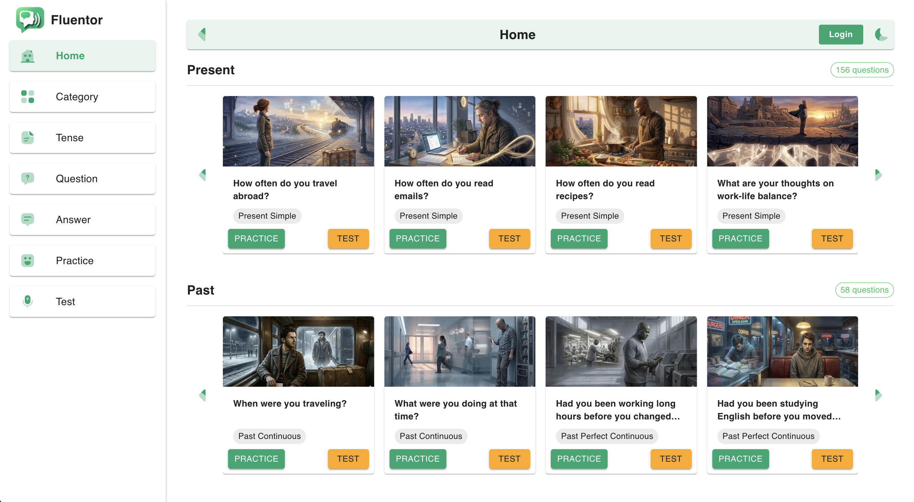
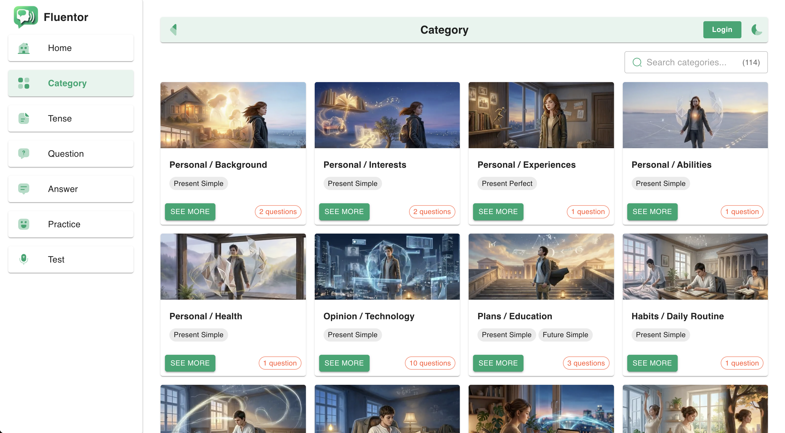
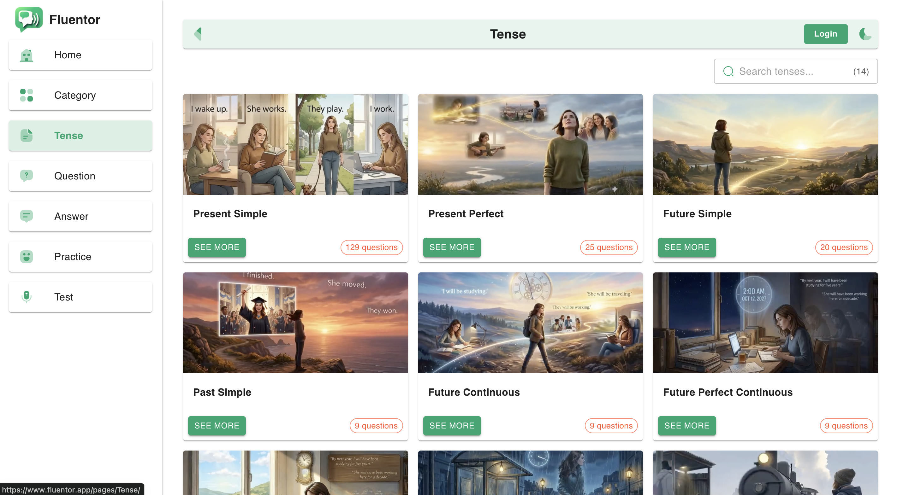
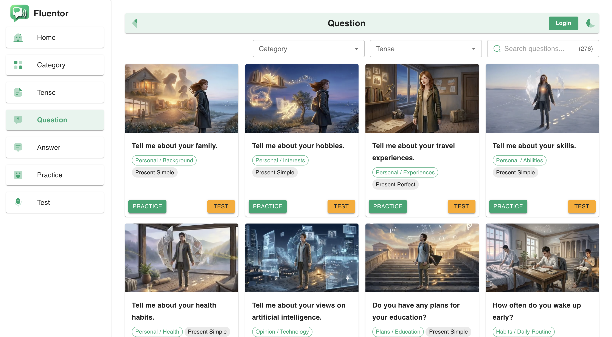
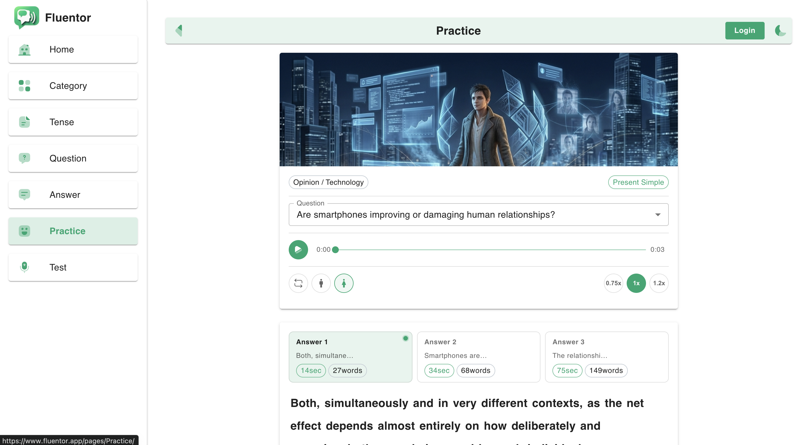
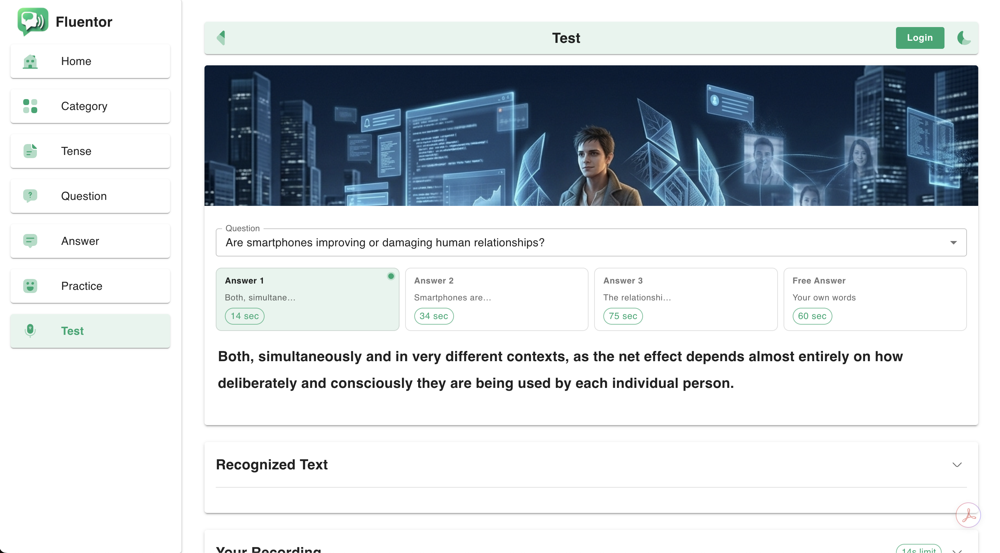
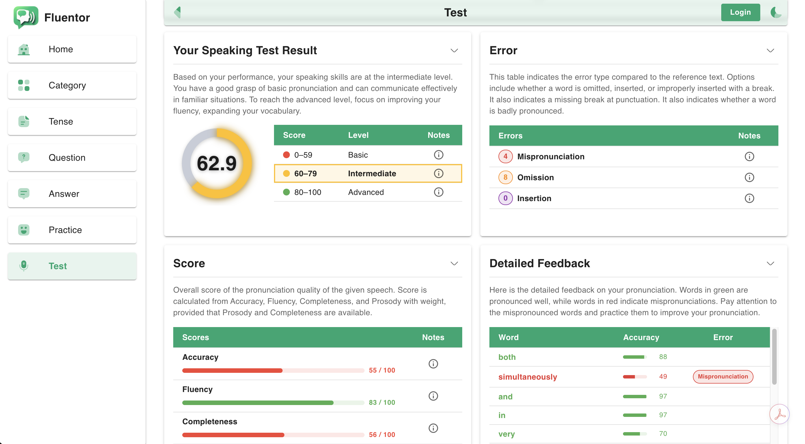
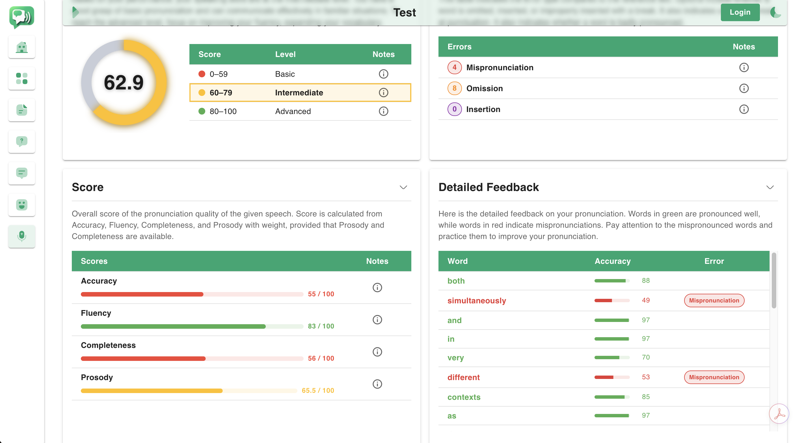

# Overview

Fluentor is an intelligent language-learning assistant with voice recognition and text-to-speech (TTS). It analyzes your speaking skills, provides an estimated score, clearly explains each evaluation using rule-based reasoning, and builds a personalized improvement plan tailored to your goals.

How can Fluentor help you?

Beyond scoring, Fluentor gives you practical tools to learn how to speak English naturally and fluently. You follow structured speaking templates that guide each practice session, use shadowing techniques to model native speech, and train your pronunciation, rhythm, and intonation in a natural way. These methods are grounded in cognitive learning principles, helping you internalize patterns and speak more like a native speaker over time.

Fluentor has helped students achieve their goals through personalized feedback, guided speaking practice, and clear learning pathways.

How accurate are Fluentor’s predictions?

Fluentor’s predictions match the same margin of error found between human examiners, delivering highly reliable and consistent results.

Disclaimer: Fluentor scores are estimates provided for informational purposes only and do not represent official English test results.

# Speaking Performance Metrics

- Fluency & coherence
- Pronunciation clarity
- Lexical resource (vocabulary level and variety)
- Grammatical range & accuracy
- Speaking speed (words per minute)
- Hesitations (long pauses)
- Silence ratio detection

# Evaluation Criteria

Fluency & Delivery

- Fluency and pause patterns
- Hesitations and fillers (uh, um, like)
- Speaking rhythm and stress
- Silence metrics
- Repetition and repetitive structures

Vocabulary & Lexical Use

- Vocabulary richness (basic vs. advanced terms)
- Lexical diversity and word variety
- Use of adjectives
- Appropriate use of connectors (because, although, however)

Grammar & Structure

- Overall grammar accuracy
- Correct verb forms
- Tense usage and tense errors
- Article usage (a, an, the)
- Preposition errors
- Subject–verb agreement
- Sentence length and complexity
- Simple structures only (overuse detection)
- Complex structure errors
- Malformed phrases

Pronunciation & Phonetics

- Pronunciation clarity
- Mispronounced vowels
- Word stress issues
- Rhythm and intonation
- Final consonant drops (common error)
- Dropped endings and skipped words

Content & Task Achievement

- Content relevance
- Content coverage
- Task completion

What You Get

- Actionable Output
- Clear, detailed feedback
- Practical improvement tips
- Error identification with explanations
- Personalized guidance for fluency, accuracy, and natural speech

# Commands

```

npx create-next-app@15 .

✔ Would you like to use TypeScript? … No
✔ Which linter would you like to use? › ESLint … Yes
✔ Would you like to use Tailwind CSS? … No
✔ Would you like your code inside a `src/` directory? … Yes
✔ Would you like to use App Router? (recommended) … Yes
✔ Would you like to use Turbopack? (recommended) … No
✔ Would you like to customize the import alias (`@/*` by default)? … Yes

-- Install Packages
npm i -D prettier eslint-config-prettier eslint-plugin-prettier
npm i -S @iconify/react
npm i -S better-sqlite3
npm i -D gh-pages

-- Copy files to /src/app folder
not-found.js

-- Copy files to /public folder
robot.txt
sidemap.xml
CNAME

-- Copy files to root / folder
.env.local
.eslintrc.json
.prettierrc
.prettierignore
.npmrc

-- Copy files to /src/app/context

-- Delete file
next.config.mjs

-- Run commands

npm run format
npm run lint
npm run build
npm run deploy

-- Create Files

gh-pages/.nojekyll
gh-pages/_next/.nojekyll

-- Deploy
npm run predeploy
npm run deploy

-- Material UI

npm i -S @fontsource/roboto
npm i -S @mui/material @emotion/react @emotion/styled @mui/icons-material
npm i -S @mui/x-date-pickers dayjs @mui/x-data-grid
npm i -S @mui/x-charts@^8.0.0

-- Database Create Table

npm run clean-db
npm run migrate

-- Database Create Seed

npm run seed_category
npm run seed_tense
npm run seed_question
npm run seed_answer
npm run seed_result
npm run seed_record

npm run seed_training
npm run seed_exam
npm run seed_type_question
npm run seed_exam_training
npm run seed_timed
npm run seed_answer_vocabulary
npm run create_question

-- Crud

-- Remove Packages

npm remove @refinedev/core
npm remove @refinedev/mui
npm remove @refinedev/nextjs-router
npm remove @refinedev/simple-rest

-- Install Icons

npm i -S @iconify/react
npm i -S iconsax-reactjs

-- Install XLSX

npm i -S xlsx

-- Image Effects

npm i -s react-parallax-tilt
npm remove react-parallax-tilt

-- Kinde

npx nypm add @kinde-oss/kinde-auth-nextjs
npm remove @kinde-oss/kinde-auth-nextjs

-- Clerk

npm i -S @clerk/nextjs@6.22.0
npm remove @clerk/ui

npm i -S @clerk/nextjs@latest @clerk/backend@latest
npm i -S --legacy-peer-deps

-- Vercel

npm i -g vercel

-- Azure Pronunciation Assessment

npm i -S microsoft-cognitiveservices-speech-sdk

-- API

--  Vercel Analytics

npm i -S @vercel/analytics
npm i -S @vercel/speed-insights

```

# Domain Management

https://www.spaceship.com/application/domain-list-application/

# Demo

https://devrazec.github.io/fluentor

https://fluentor.app/

# Project

https://github.com/devrazec/fluentor

# Links

https://www.freeconvert.com/png-to-ico

https://www.candyicons.com/free-tools/favicon-generator

https://www.lightswind.com/components/

https://example.crm.refine.dev/

https://iconsax-react.pages.dev/

https://icon-sets.iconify.design/

https://dashboard.clerk.com/

# Azure Pronunciation Assessment

https://portal.azure.com/#view/Microsoft_Azure_CostManagement/Menu/~/costanalysis

https://ai.azure.com/build/overview?tid=58e31257-f77f-4d58-9705-d0b6ea0f9ee4&wsid=/subscriptions/3cd4d0fd-b0ac-4e13-a6d1-6a970f3f4f91/resourcegroups/rg-Voice-Live/providers/Microsoft.MachineLearningServices/workspaces/voice-live

# Google Analytics

https://search.google.com/search-console?utm_source=about-page&resource_id=https://www.fluentor.app/

https://analytics.google.com/analytics/web/#/a387332422p528060744/reports/dashboard?params=_u..nav%3Dmaui&ruid=user-demographics-overview,user,demographics&restoreUserState=true&r=user-demographics-overview

# Pronunciation Assessment

https://ai.azure.com/explore/models/aiservices/Azure-AI-Speech/version/1/registry/azureml-cogsvc

https://learn.microsoft.com/en-us/azure/ai-services/speech-service/how-to-pronunciation-assessment?pivots=programming-language-javascript

https://github.com/Azure-Samples/cognitive-services-speech-sdk/blob/master/scenarios/javascript/node/language-learning/pronunciationAssessment.js

https://ai.azure.com/explore/aiservices/speech/pronunciationassessment

https://ai.azure.com/explore/models/aiservices/Azure-AI-Speech/version/1/registry/azureml-cogsvc/tryout

# Voice Live

https://github.com/microsoft-foundry/voicelive-samples/tree/main/voice-live-universal-assistant

# Web Interface

http://localhost:3000










# Email Forward

https://app.improvmx.com/

hello@fluentor.app

# Links

https://www.youtube.com/channel/UCtU0aQ7W6yQCR_dewakTFbg

https://www.facebook.com/61578543483205/

https://www.instagram.com/fluentor.app/

https://fluentor.vercel.app/

https://fluentor.app/

https://www.fluentor.app/

# Texts

TESTE SUA PRONÚNCIA DO INGLÊS (AVANÇADO ...

Pronúncia em inglês — Pratique sua conversação sem medo e sem julgamentos. Garanta 60% de desconto agora!

Ótimo aplicativo para melhorar sua pronúncia em inglês

Linguaskill é um teste de inglês multível com resultados em 48 horas. Realiza-se por computador e permite-lhe avaliar as quatro competências de forma rápida e

Iniciar o Teste! Perguntas e respostas frequentes sobre este teste de compreensão oral. Quantas palavras há em cada nível?

Treinar pronúncia em inglês pode ser uma parte desafiadora do aprendizado de um novo idioma, mas nossos exercícios e materiais imprimíveis podem ajudar a

Professionals trust Pronounce's free speech checker to improve their pronunciation. Speak English clearly and effectively. Simply begin by recording your

Pronunciation Test. Students can test their pronuniciation, speaking and listening fluency. Student need to listen to a short audio clip and repeat what they

We are the first and only speech recognition API designed for evaluating and giving feedback on pronunciation and fluency.

Improve Speaking — Master your English speaking skills with Fluently. Practice & get instant AI feedback! Fix your

Find Out About Your Accurate English Level. 100 questions for a precise result (A1-C2). Find your true English level now. Free Test.

english dialogue practice — SpeakFlow: Beyond simple vocabulary. Build your English Speaking Skills with AI. From Zero to

SpeakFlow is 20x more affordable than human tutors and available 24/7 for unlimited speaking practice, pronunciation correction, and personalized feedback.

Everything you need to speak confidently
Our AI tutor adapts to your level, corrects your mistakes in real-time, and helps you build lasting confidence.

Real-time Speech Analysis
Get instant feedback on pronunciation, intonation, and rhythm as you speak naturally.

e play para escutar o audio da pergunta e da resposta.

Fluêntor. Pratique sua pronúncia em inglês com o Fluêntor. Ótimo aplicativo para melhorar sua pronúncia. Veja como é fácil usar o Fluêntor. Apenas click no botão practice.
Depois, click no botão play para ouvir a pergunta e a resposta.

Repita para praticar a pronúncia.

https://youtube.com/shorts/yHawgGe3u3Y?feature=share

# Facebook

https://developers.facebook.com/apps/1471387871331001/dashboard/?business_id=905291982279288
